# Convex-Hull
Draw 2D and 3D convex hulls based on sets of randomized input points.
<p align='center'>
  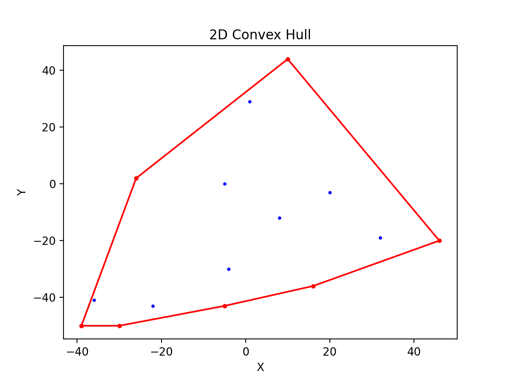
  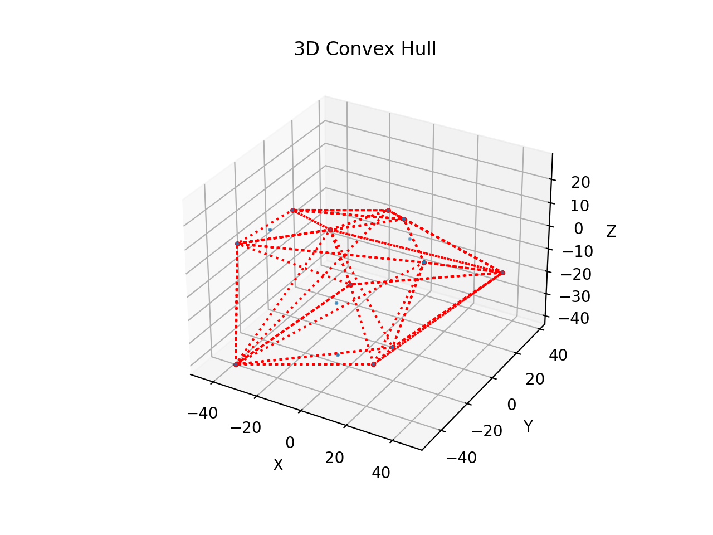
</p>

## How to Run
1. pip install requirements.txt
2. python main.py
3. A set of randomized 2D and 3D points will be generated, and plotted on two figures, one for 2D and the other one for 3D.

## Usage and Information
### File main.py 
Contains unit testing functions and parameter configurations that perform randomized tests for 2D and 3D ConvexHull objects.

| Parameter Name  | Accepted Values | Description
| ------------- | ------------- | ------------- |
| numPointsToAdd  | int  | Number of randomized points to generate for the convex hull. |
| numPointsToCheck  | int  | Number of randomized points to test if in the hull. |
| minX  | int  | Minimum value of a generate point in x axis. |
| maxX  | int  | Maximum value of a generate point in x axis. |
| minY  | int  | Minimum value of a generate point in y axis. |
| maxY  | int  | Maximum value of a generate point in y axis. |
| minZ  | int  | Minimum value of a generate point in z axis. |
| maxZ  | int  | Maximum value of a generate point in z axis. |
| step  | int  | Randomized range step for the generate point. |
| dimension  | '2d' or '3d' | Test the convex hull class in 2D or 3D setting. |

### File ConvexHull.py 
Contains classes of ConvexHull2D, ConvexHull3D, and Point. Call help(ConvexHull3D) in Python for more information.
```python
a_2d_point = Point(1, 2)
a_3d_point = Point(1, 2, 3)
ch_2d = ConvexHull2D() # doesn't take any argument
ch_3d = ConvexHull3D() # doesn't take any argument
see main.py for more usage examples
```
#### Methods for ConvexHull2D and ConvexHull3D classes
| Instance Method  | Parameters | Returns | Description
| ------------- | ------------- | ------------- | ------------- |
| \_\_str\_\_  | None  | None | call print() on an instance will tell you its current points and hull points. |
| add | a Point object | None | Add a Point object to the instance. |
| remove | a Point object | None| Remove a Point object from the instance. |
| plot  | None | None | Display the current points and hull points from the instance. |
| within  | a Point object | bool | Return true if a given point coordinate is inside the hull area/volume otherwise false. |
| hull  | None | None | Perform a convex hull operation on points within the instance object. |
| getAllPoints  | None | List[Point]  | Return a list of all points within the instance object. Deep copy. |
| getHullPoints  | None | List[Point]  | Return a list of current hull points within the instance object. It doesn't do the convex hull, it just give you a list of hull points from the previous hull call. Deep copy.|

```
Warning:
1. Add only Point object with x and y coordinates into a ConvexHull2D object.
2. To obtain an accurate convex hull after adding or removing Points, please call the hull method again. 
```

## Example Runs
<p align='center'>
  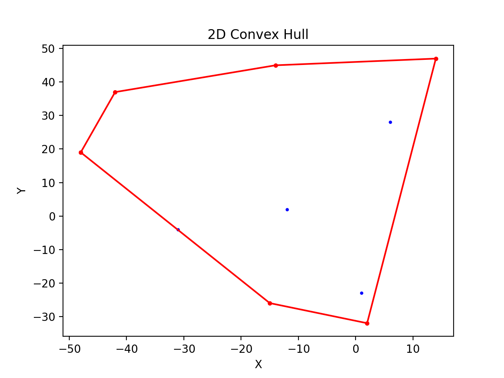  
  
  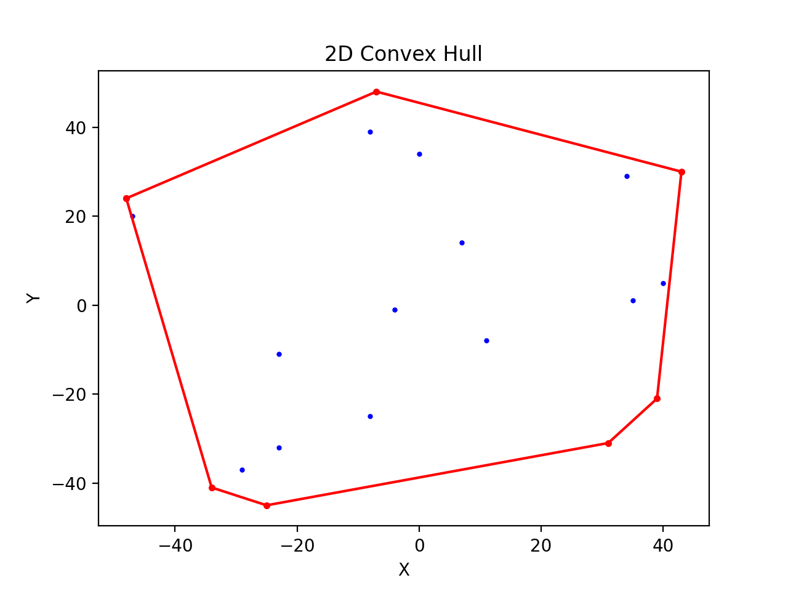
  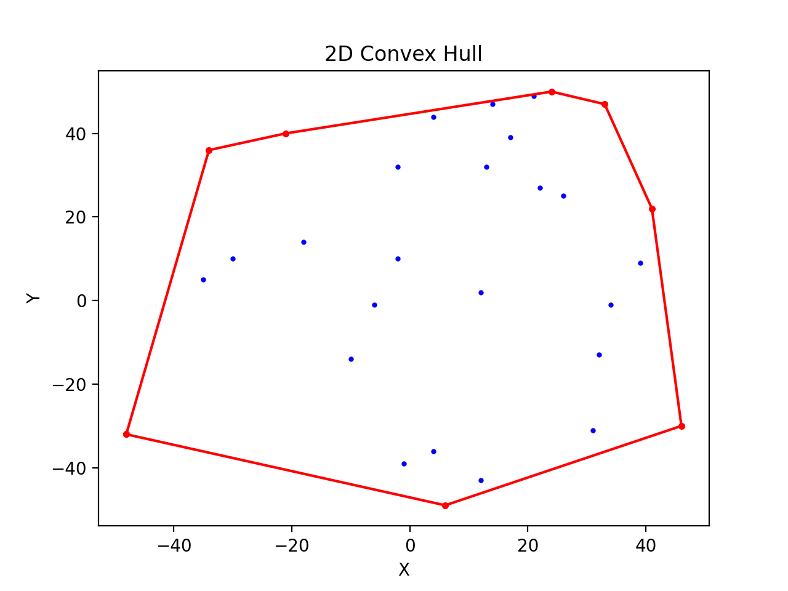
  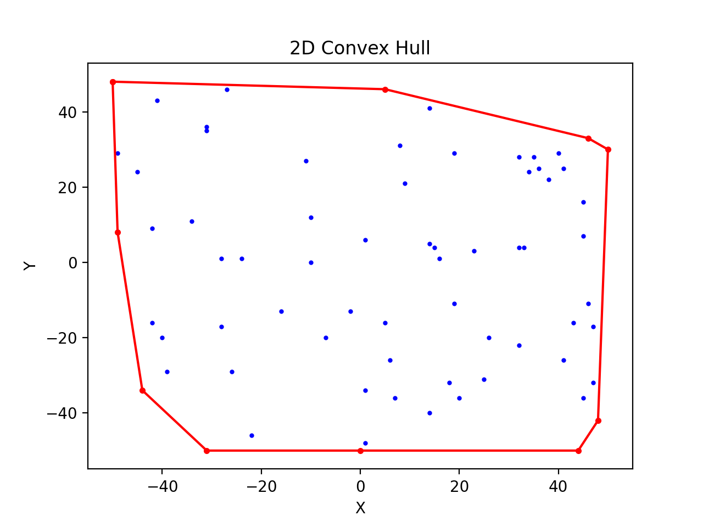
  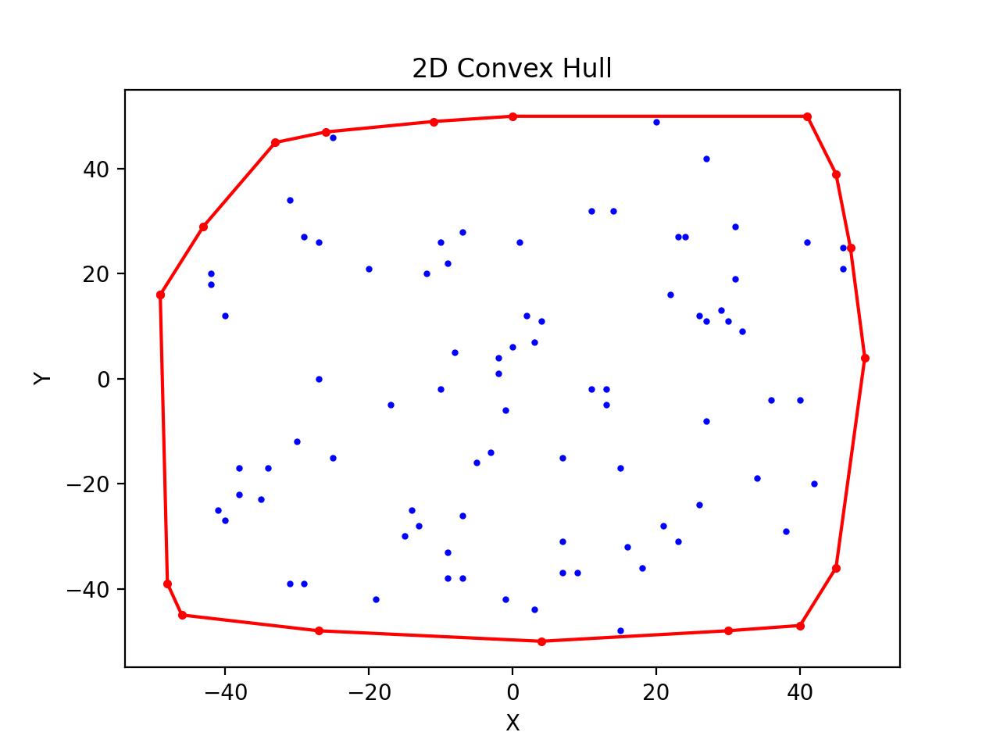
  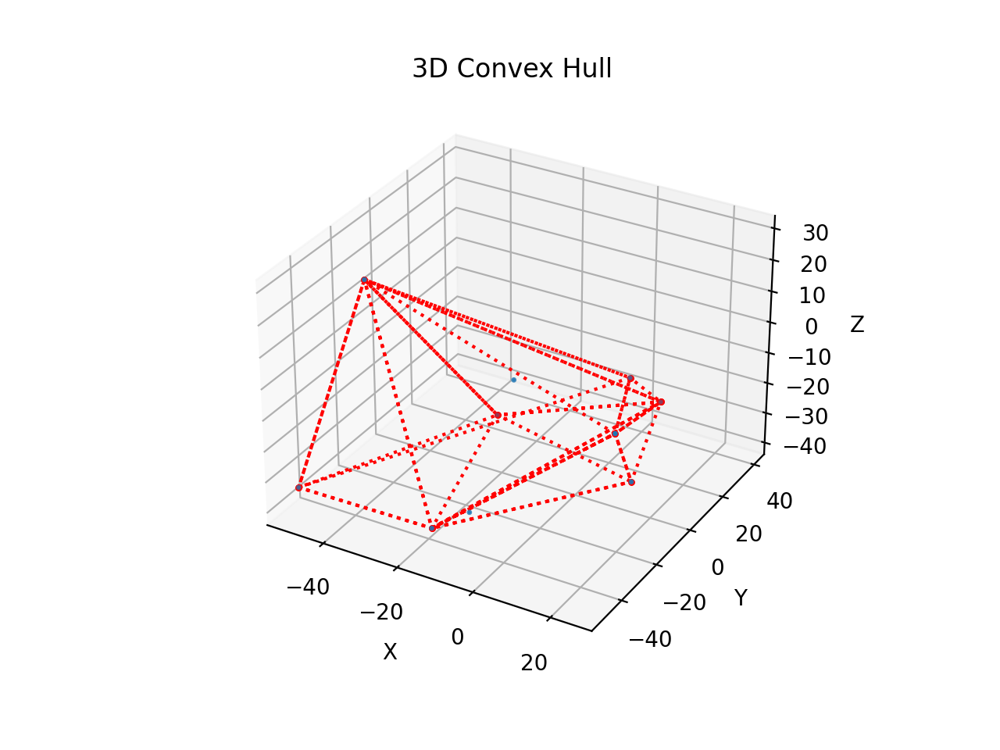  
  
  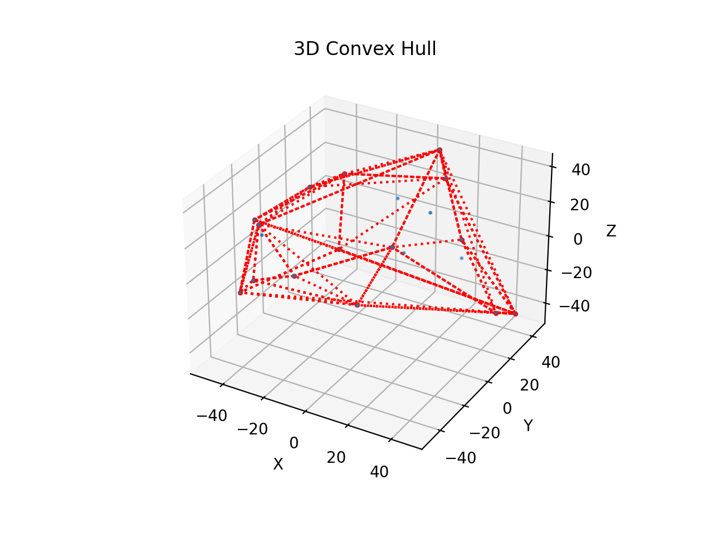
  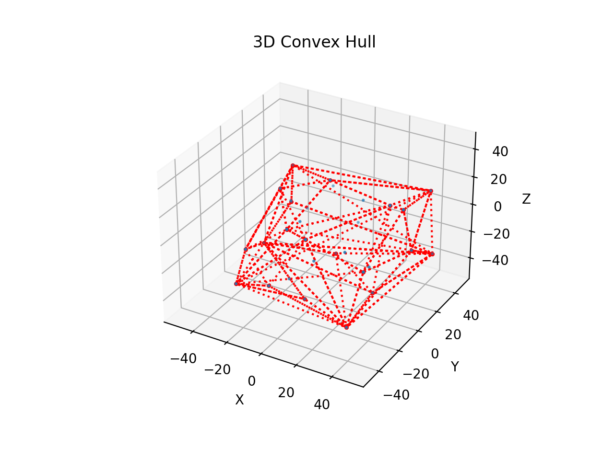
  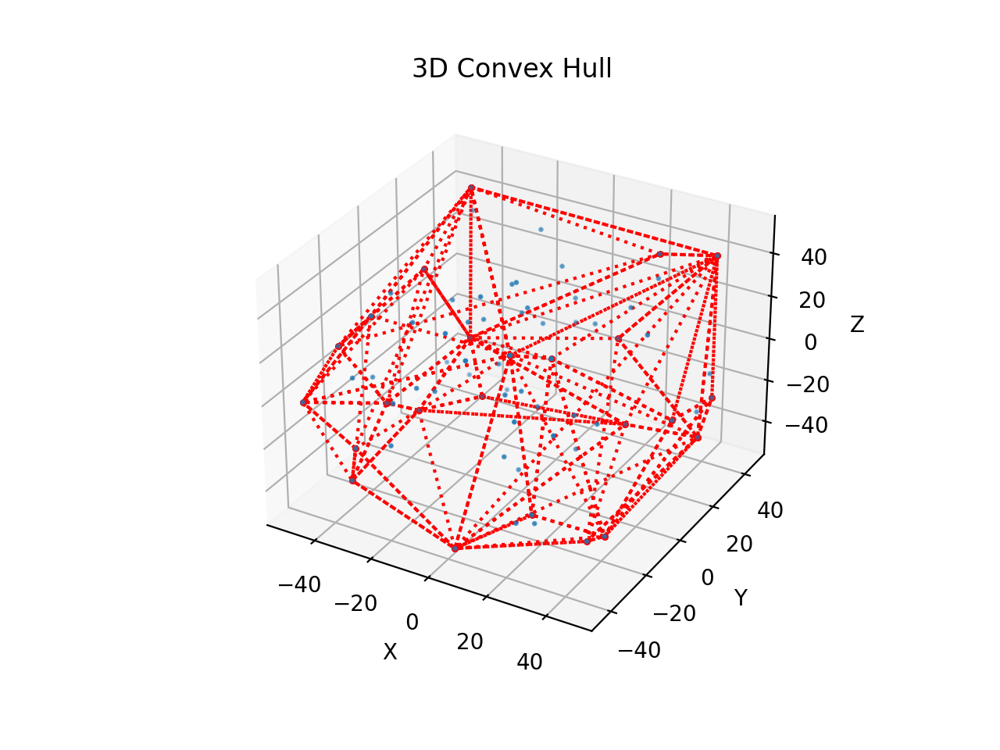
  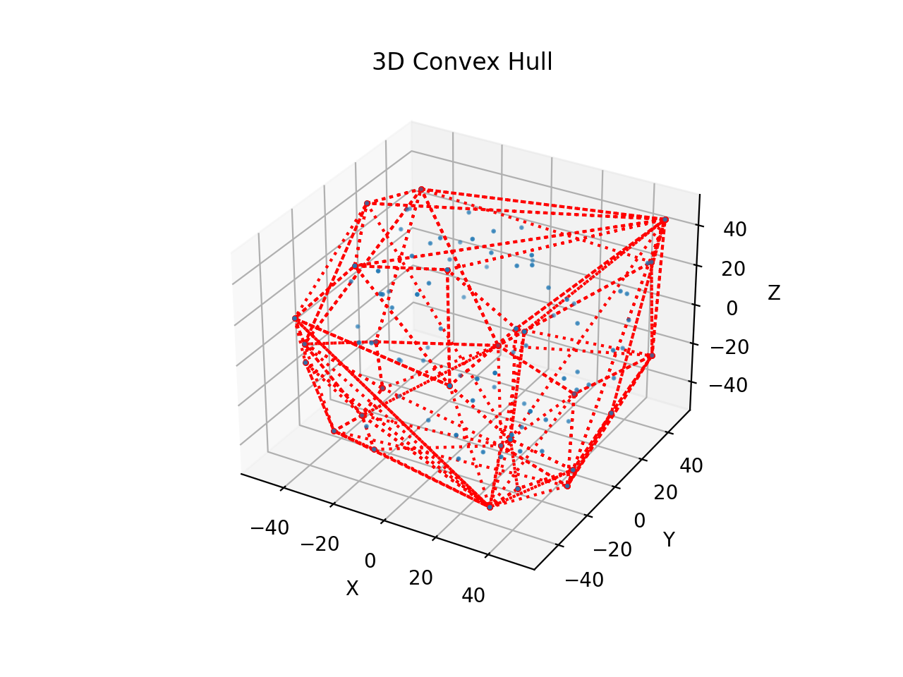
</p>
